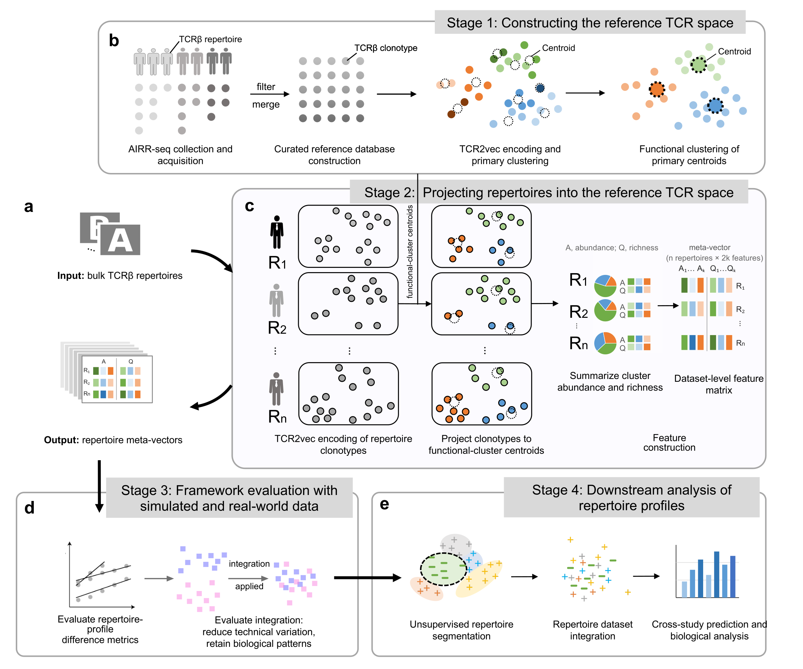

# MetaTCR: A Framework for Analyzing Batch Effects in TCR Repertoire Datasets

MetaTCR is a computational framework designed to standardize disparate T-cell Receptor (TCR) repertoires and systematically correct for batch effects to enable robust downstream analysis. The framework transforms variable-length TCR repertoire data into fixed-dimensional meta-vectors by projecting individual repertoires onto a standardized reference space, facilitating large-scale integration and batch correction.

Main scripts required to reproduce the paper's experiments and analyses are hosted at this [repository: MetaTCR_paper](https://github.com/deepomicslab/MetaTCR_paper).

## Framework Overview

<p align="center">
  
</p>

MetaTCR (1) builds a population-scale **reference TCR space** from many repertoires, (2) projects each repertoire onto it to produce fixed-length **meta-vectors**, and (3) uses those meta-vectors to measure and correct batch effects for downstream analysis.

## Installation

### Prerequisites

- Python >= 3.8

### Dependencies

Most dependencies are handled automatically by `setup.py`. However, you must install PyTorch manually according to your CUDA version.

- **PyTorch**: >= 1.9.1 (We tested on 1.9 and 2.5)
  - Please install the appropriate version for your system from [pytorch.org](https://pytorch.org/).

Other dependencies (automatically installed):
- numpy, pandas, scipy, sklearn, matplotlib, seaborn, tqdm
- tape_proteins, faiss-gpu, umap-learn, configargparse, biopython, etc.

### Install MetaTCR

1. Install Cython (required for building extensions):
```bash
pip install cython==3.1.5
```

2. Install MetaTCR package:
```bash
cd /path/to/MetaTCR
pip install .
```

Alternatively, you can install directly from the source:
```bash
pip install -e .
```
Typical installation time is about 2-10 minutes, depending on network speed.

## Pre-trained Models

MetaTCR uses the **TCR2vec** model to encode TCR clonotypes into numerical vectors. Place the pre-trained model in `pretrained_models/TCR2vec_120/`.

**Model Download**: available on [Google Drive](https://drive.google.com/file/d/1Nj0VHpJFTUDx4X7IPQ0OGXKlGVCrwRZl/view?usp=sharing).

*Note: the code downloads the model automatically if it is missing — install `gdown` (`pip install gdown`) to enable this, or download it manually from the link above.*

After downloading, extract the model files to `pretrained_models/TCR2vec_120/`, which should contain `pytorch_model.bin`, `args.json`, and `config.json`. The model comes from [TCR2vec](https://github.com/jiangdada1221/TCR2vec); see `pretrained_models/README.md` for more details.

## Data Availability

The large data files are archived on Zenodo:
- **Zenodo**: https://doi.org/10.5281/zenodo.22068981

They are provided as three archives:
- `database.tar.gz` — reference TCRβ sequences + pre-computed TCR2vec embeddings
- `repertoire_data.tar.gz` — the processed input repertoires
- `encoding.tar.gz` — MetaTCR-encoded meta-vectors (`*.pk`)

### Download Requirements

Which archives you need depends on where you start:
- **Step 1 — rebuild the reference from scratch:** `database.tar.gz`.
- **Step 2 — encode your own repertoires:** *nothing* — the reference centroids and cluster mappings already ship in `./data/processed_data/`.
- **Step 3/4 — reproduce our analysis:** `encoding.tar.gz` (our encoded meta-vectors).
- `repertoire_data.tar.gz` — only if you want to re-encode our input repertoires from raw.

**Where to place the extracted files.** Each archive extracts to a top-level folder whose name does **not** always match the target path in this repository, so after `tar -xzf` move the contents as shown (paths are relative to the repository root):

| Archive (extracts to) | Its contents | Move to |
| :--- | :--- | :--- |
| `database.tar.gz` → `database/` | `MetaTCR_reference_fullseq.txt` | `./data/database/` |
| | `reference_embeddings/` | `./data/reference_database/` |
| `repertoire_data.tar.gz` → `repertoire_data/` | the per-study repertoire folders | `./data/repertoire_data/` |
| `encoding.tar.gz` → `encoding/` | `*.pk` (meta-vectors) | `./data/processed_data/datasets_mtx_1024_downstream/` |

Example (run from the repository root):

```bash
# reference database + embeddings
tar -xzf database.tar.gz
mv database/MetaTCR_reference_fullseq.txt ./data/database/
mkdir -p ./data/reference_database && mv database/reference_embeddings ./data/reference_database/

# encoded meta-vectors  (note: encoding/ -> datasets_mtx_1024_downstream/)
tar -xzf encoding.tar.gz
mkdir -p ./data/processed_data/datasets_mtx_1024_downstream
mv encoding/*.pk ./data/processed_data/datasets_mtx_1024_downstream/

# input repertoires (optional)
tar -xzf repertoire_data.tar.gz
mv repertoire_data/* ./data/repertoire_data/
```

## Usage

You can start from any step depending on your needs. For most users encoding their own data, **start from Step 2** using the provided pre-computed centroids. A few example repertoire files are bundled at `data/demo_data/Emerson2017_demo/`.

**Step 1: Generate TCR functional clusters** *(optional — only to build a custom reference from scratch).* Encodes the reference database with TCR2vec and clusters the embeddings into functional centroids. Embeddings can be cached as sharded `.npy` with `--save_embeddings` and reused with `--load_embeddings`.
```bash
python step1.generate_TCR_functional_clusters.py
```

**Step 2: Encode repertoires to meta-vectors.** Uses the pre-computed centroids in `./data/processed_data/` to turn repertoires into a `.pk` of meta-vectors (~1–3 min on a desktop GPU for the demo).
```bash
# unlabeled data — searches the directory (and subdirectories) for all .tsv repertoires
python step2.dataset_to_meta_matrix.py --unlabeled_dir data/demo_data/Emerson2017_demo --dataset_name Emerson2017_demo --tcr2vec_path ./pretrained_models/TCR2vec_120
```
```bash
# labeled data — separate positive / negative sample directories
python step2.dataset_to_meta_matrix.py --pos_dir data/demo_data/Emerson2017_demo/CMVpos/ --neg_dir data/demo_data/Emerson2017_demo/CMVneg/ --dataset_name Emerson2017_demo --tcr2vec_path ./pretrained_models/TCR2vec_120
```

**Step 3: Measure quantitative metrics** between encoded datasets (kBET, MMD, JSD, SCE, cosine, iLISI). Datasets are passed on the command line — two are scored as one pair, more as every pair. With no arguments it runs on the bundled demo pair.
```bash
# demo pair
python step3.calculate_dataset_distance.py

# your own datasets (full .pk paths, or bare names resolved under --data-dir)
python step3.calculate_dataset_distance.py \
    --datasets data/processed_data/datasets_mtx_1024_downstream/Huth2019.pk \
               data/processed_data/datasets_mtx_1024_downstream/Emerson2017.pk
```

**Step 4: Correct batch effects** by integrating encoded datasets and scoring cohort mixing. Use `--mode` to choose *pairwise* (align a source to a target) or *multi* (jointly integrate several); datasets are passed with `--datasets`. With no arguments it runs both modes on the bundled demo datasets.
```bash
# demo: both modes on the bundled datasets
python step4.batch_integration.py

# pairwise: source aligned to target
python step4.batch_integration.py --mode pairwise \
    --datasets data/processed_data/datasets_mtx_1024_downstream/Huth2019.pk \
               data/processed_data/datasets_mtx_1024_downstream/Emerson2017.pk

# multi: jointly integrate several datasets (bare names under --data-dir)
python step4.batch_integration.py --mode multi \
    --data-dir data/processed_data/datasets_mtx_1024_downstream \
    --datasets Huth2019 Heather2015 Wang2022 Wright2026
```

## Data Preprocessing

Before encoding repertoires with MetaTCR, raw TCR repertoire data must undergo quality control and preprocessing:

1. **Quality Control**:
   - Filter out entries with CDR3β chain lengths shorter than 10 amino acids
   - Remove sequences containing stop codons
   - Retain only amino acid sequences beginning with cysteine (C) and ending with phenylalanine (F)
   - Select the most abundant clones (up to 10,000 per repertoire)

2. **Required Data Fields**: each repertoire file must contain the CDR3 amino-acid sequence, V gene, J gene, and clone frequency/count.

3. **Full-length Sequence Reconstruction**: for repertoires containing only CDR3 + V + J, reconstruct full-length TCR sequences with `pre_process_scripts/cdr3_to_full_seq.py` ([original code reference](pre_process_scripts/cdr3_to_full_seq.py#L3-L4)); a runnable demo is `pre_process_scripts/demo_generate_TCR_fullseq.sh`. It aligns the CDR3 to the IMGT V- and J-segment sequences and stitches them into the full-length sequence.

4. **Input Data Format**: processed repertoire files should be TSV with columns including `aminoAcid` (CDR3), `vMaxResolved` (V gene), `jMaxResolved` (J gene), `frequencyCount`, and `full_seq` (full-length sequence). See `data/demo_data/Emerson2017_demo/` for the expected input format.

## Antigen-specificity data

McPAS-TCR-derived records support the antigen-specificity validation and the semi-synthetic EBV spike-in analysis. The balanced antigen-validation set ships in this repository at [`data/antigen/`](data/antigen/); see its README for the columns, provenance, and the McPAS-TCR citation / redistribution note.

## Citation

If you use MetaTCR in your research, please cite:

```
[Citation information to be added]
```

## License

This project is licensed under the GPL-3.0 License.

## Contact

For questions and issues, please contact:
- **Author**: Miaozhe Huo
- **Email**: miaozhhuo2-c@my.cityu.edu.hk

## Acknowledgments

MetaTCR builds upon the TCR2vec model for TCR sequence encoding. We acknowledge the original TCR2vec authors for their valuable contribution.
